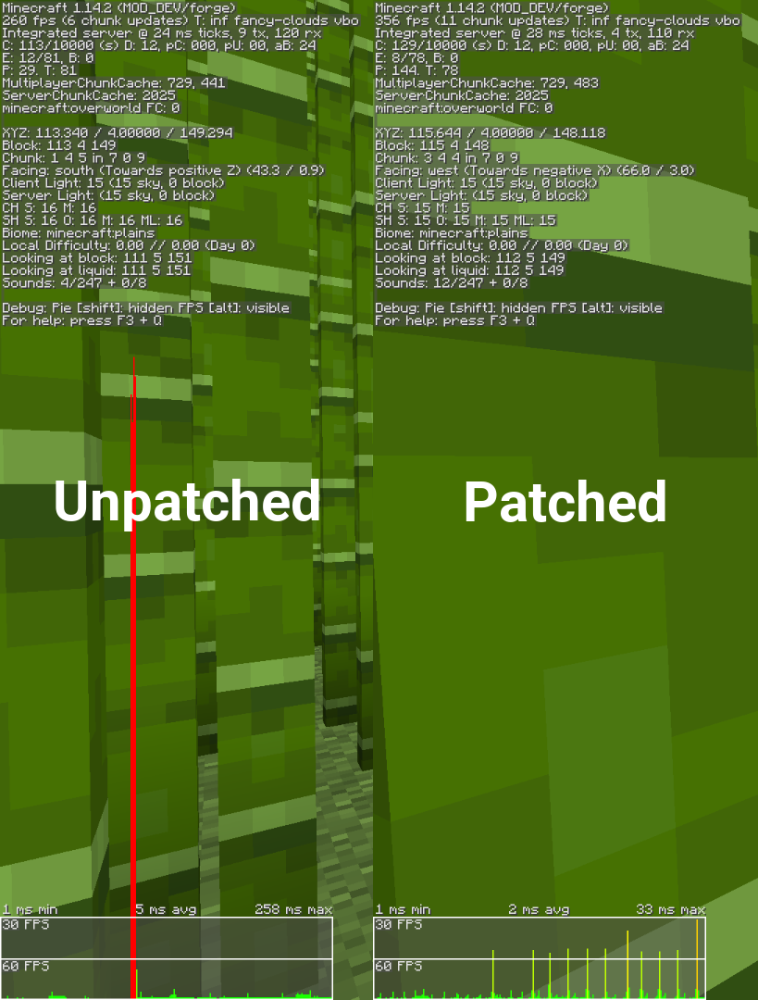

# Fast Bamboo

*Fixes an oversight in the vanilla BambooBlock class*

**This mod is open source and under a permissive license.** And as such,
can be included in any modpack on any platform without prior permission.
We appreciate hearing about people using our mods, but you do not need
to ask to use them. See the [LICENSE file](LICENSE) for more details.

Fast Bamboo makes a small adjustment to the BambooBlock class by overriding a method that gets called during rendering. The value returned from this method will always end up returning 1F, but due to Mojang not overriding the method it ends up running some expensive logic for *every bamboo block in the chunk it renders.* Fast Bamboo patches this method to always return 1F instead of running the logic for every block. This reduces the amount of time it takes to render bamboo, it's not perfect but it's  still a lot better than vanilla.

## Performance

